<h2 align="center">Teste Frontend CREDERE</h2>

<hr/>

## ⚙️ Tecnologias Usadas:

- CSS3
- JavaScript
- React Js
- Styled Components
- Sweetalert2

## ⚙️ Estrutura do Projeto

- Arquivo `.gitignore`
- Arquivo `package.json`
- Arquivo `package-lock.json`
- Pasta `node_modules`: Armazena os pacotes das dependências que definimos no arquivo package.json. Também deve ser observado que este diretório é definido dentro de .gitignore para que todas as dependências infinitas não sejam carregadas para o repositório Git. Portanto, quem baixar o projeto instalará as dependências [diretamente da web](https://www.npmjs.com/)
- Pasta `public`: Ele contém os arquivos estáticos que nos permitirão montar o aplicativo.
- Pasta `src` (source): A pasta src é a pasta onde nosso código React está localizado.

## ⚙️ Explicação da Estrutura

Escolhi a biblioteca Reactjs para desenvolver este desafio, o qual consiste em construir uma pequena aplicação dividida em duas partes:

- Um formulário

O desafio consiste em fazer um formulário que o usuário possa preencher de forma confortável e seguindo uma série de regras. As informações tem que ser guardadas seguindo o mockup da API enviada no teste.

A primeira coisa que fiz para abordar a situação foi tratar todos os dados dos campos input de forma lineal. Posteriormente tive que formatar eles para que ficaram do mesmo jeito que da resposta da API.

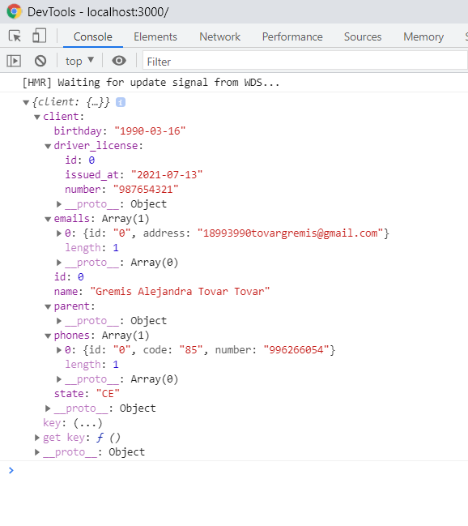

Depois que os dados adquiriram o mesmo formato que a API, juntei os dois arrays que ficaram: um array que já continha 2 clientes registrados (arquivo index.json) junto com os futuros clientes por registrar(dados que vem do submit, nesse caso tem o nome de FormData).

Para fazer a união e manipulação dos arquivos existentes e o novo, decidi usar useContext, onde criei um estado global, que contém os arquivos que simulam a API. Com isto foi possível passar informações aos filhos e vice-versa.

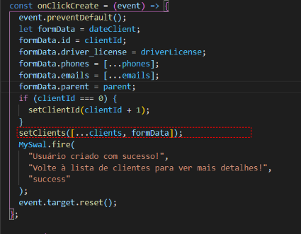

Desta forma passei as informações do index.json até o arquivo form.js e juntei os dados, dentro do arquivo form.js atualizei o state global dos dados dos clientes com a intenção que ao mostrar a lista de clientes (processo que acontece no componente ListClient) poderá renderizar um único array tanto os clientes que já existem na API como os que vão ser criados, ou seja renderizar o novo estado dos clientes.

Posteriormente, percibi que tinha um arquivo "show.json" no teste, então imaginei que seria legal o usuário poder entrar nos detalhes de cada cliente. Por isso foi que criei o botão de mostrar detalhes. Para fazer isto acontecer, trabalhei com o componente ListClient que já possuía o estado de clientes atualizados e dessa forma usando o id de cada cliente, pude repassar essas informações ao componente DetailsClients, renderizando dessa forma mais informações de cada cliente.

- Um leitor de novidades

Para abordar esta situação a primeira coisa que fiz foi criar um arquivo json que englobara todas as informações das novidades para que convergeram em um ponto comum de dados e dessa forma ao renderizar elas percorrer um array.

Desta forma percibi que o ponto comum de todas eram:

Imagem

Título

Descrição

Parágrafo (Somente 2 imagens possuíam este item). O que fiz foi criar o parágrafo em todas e deixar 2 das novidades vazias, pois no futuro podem conter um.

Percorri o array e de acordo com o index de casa novidade modifiquei em um arquivo css o estilo de cada card de novidades para que ficassem parecidas com os modelos do teste.

Um problema que se suscitou foi que não consegui encontrar o modelo das imagens de jeito nenhum. Então como elas estavam no arquivo do teste o que pensei foi em usar essas imagens e tratarlas com um editor para que ficassem sem os elementos que não correspondiam com o background.

Finalmente ao obter as imagens, montei as novidades no componente.

- Resolução das situações apresentadas:

- Carteira de motorista somente pode ser possível preencher se o cliente é maior de 18 anos:

Condicionei o input para que apareça quando o estado "isAdult" mude:

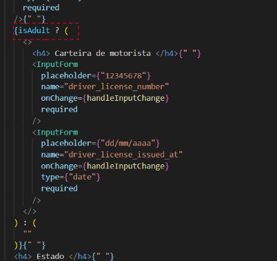

O estado muda de acordo à função:

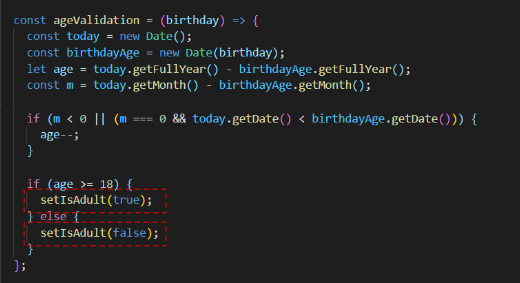

- A cidade pode ser preenchida se o estado é RN e a carteira de motorista começa com 6:

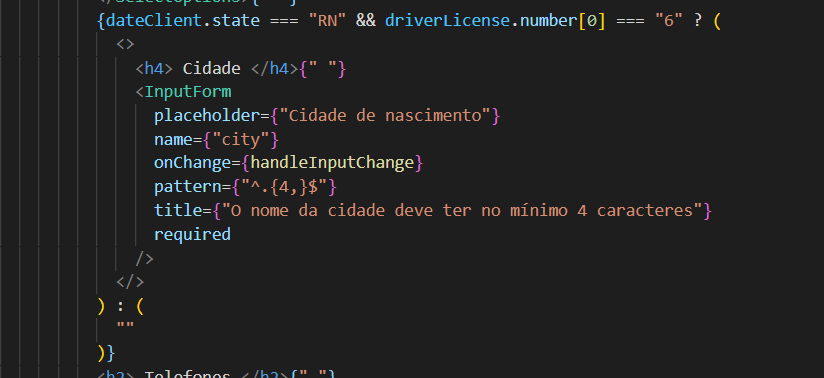


Condicionei o input da cidade para que apareça somente quando existam as duas condições:


Eu somente usei arrays, que vem das funções para formatação dos dados do formulário.

- Telefone deve ser dinâmico sendo possível ter pelo menos um telefone obrigatório e adicionar até 4. Se tem mais de um telefone tem que sinalizar qual é o telefone principal.

Essa lógica acompanha se o usuário esta ingresando um cliente que tem mais de um telefone.

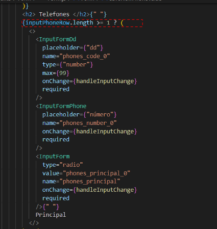

O que fiz foi manipular os campos dos input como se fossem uma lista de tarefas e recorri elas com um map, e quando o usuário remova ou adicione, se comporte como tal:

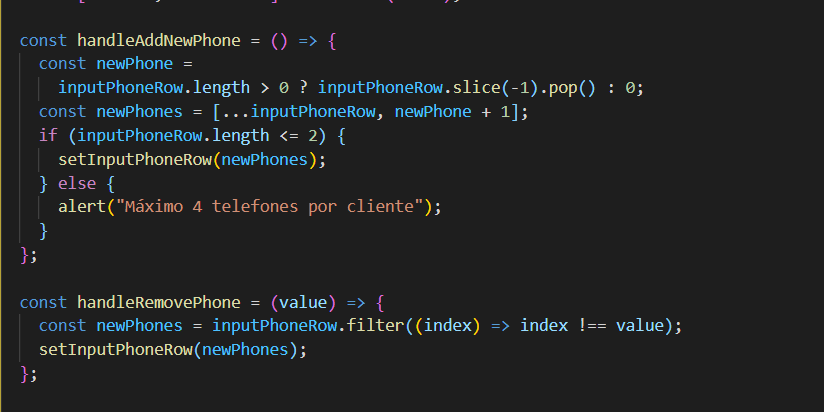

É possível remover e adicionar os campos usando as funções "handleRemovePhone" e "handleAddNewPhone":

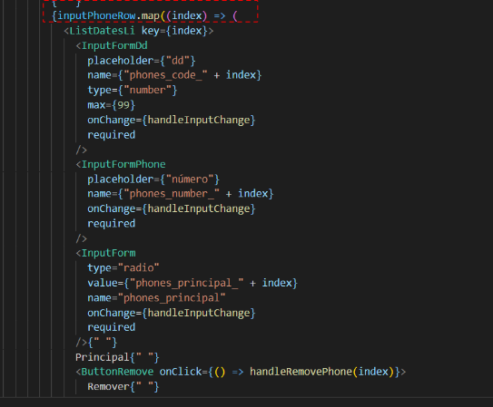


- Email deve ser dinâmico sendo possível ter pelo menos um email obrigatório e adicionar até 3.

Apliquei a mesma lógica do que os telefones, manipulei o campo dos inputs deles no estado como se fossem uma lista de tarefas:

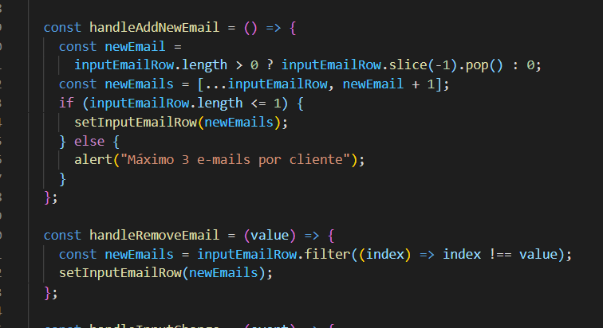

Usando funções de adicionar ou remover:


- Responsável somente é possível preencher se o cliente a registrar fosse menor de idade.

Nesta condicional usei a mesma funçaõ da validaçaõ de idade do campo carteira de motorista somente que fazendo uma condicional ao contrário.

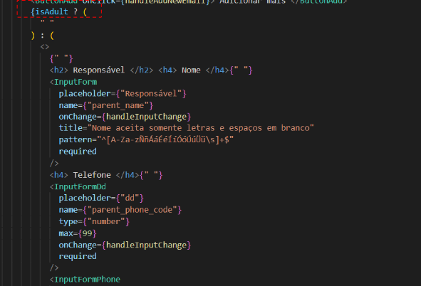

O resto das validações do formulário usei as tags de html (required, pattern, title).

- Os botões do layout devem obedecer o estado dado no teste:

Consegui isto usando a mesma linha do reactjs hooks.

- Responsividade do sistema:

Para fazer os testes de responsividade usei a ferramenta da consola dos navegadores e também screenfly, o resultado foi:

Tamanho de tela 1920:

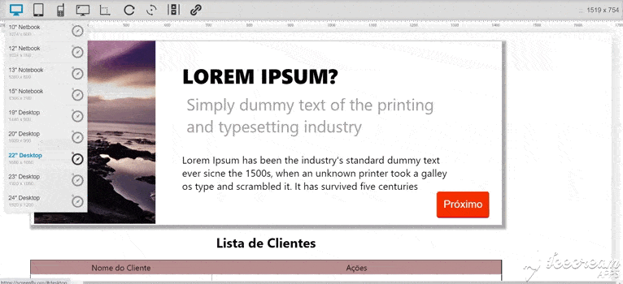

Tamanho de tela 1440:

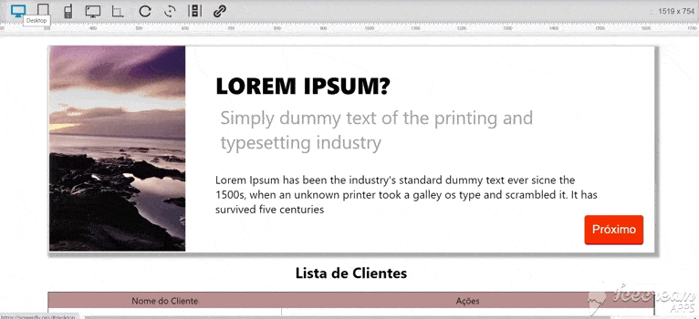

Tamanho de tela 1280:

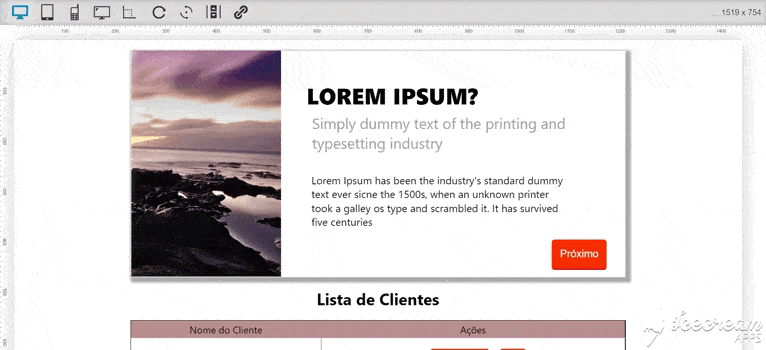

Tamanho de tela 1024:

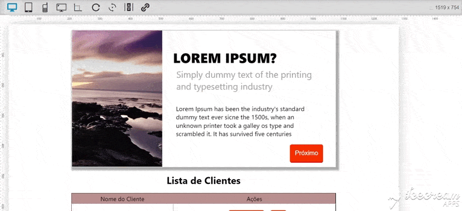

Tamanho de tela 800:

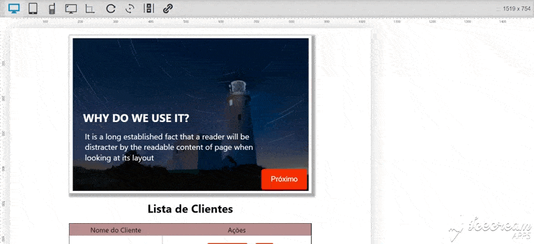

Tamanho de tela 414:

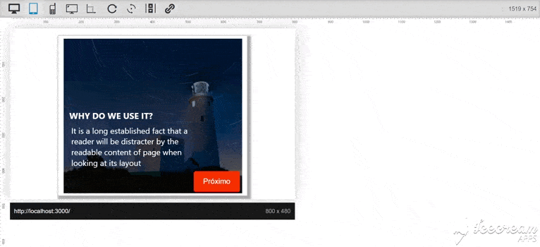

Tamanho de tela 375:

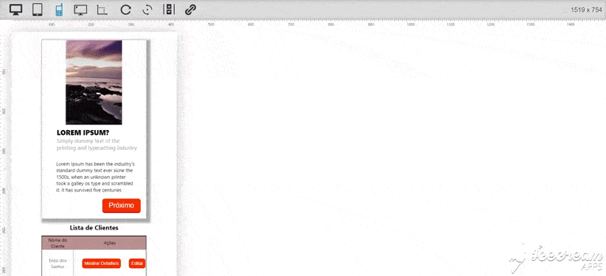

Tamanho de tela 320:

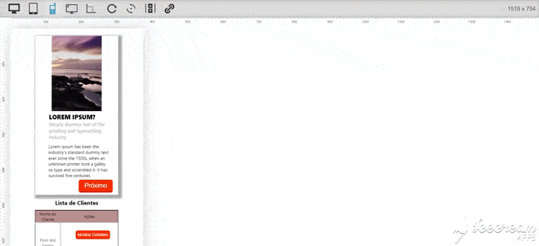


- No total o fluxo e a componetizaçao da aplicação ficou da seguinte forma:


- O que não funciona:

Editar

Testes

O slider esta feito com react hooks

Não criei novos slides.

- Bugs que percibi dentro da aplicação

Preenchimento dos telefones do cliente e do responsável: O fluxo do código é que o usuário preencha primeiro o dd e depois o número de telefone, no caso contrario o sistema alerta: "Cannot set property 'number' of undefined".

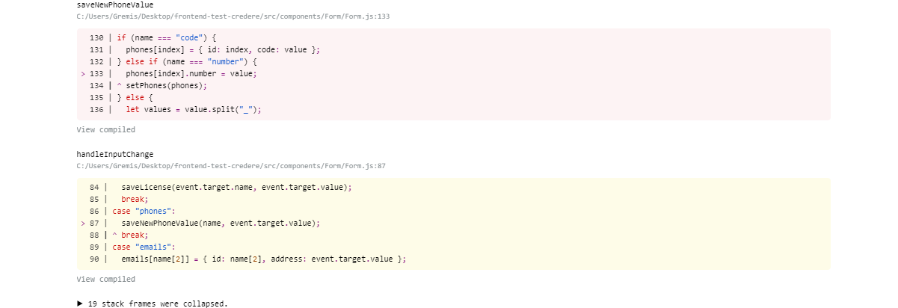


Escolher qual telefone principal: O cliente pode escolher quando tem mais de 1 telefone qual é o principal, porém não pode mostrar nos detalhes, se escolheu entre um ou outro.


## ⚙️ Pasta src ou Source:

- Arquivo Index.js:
  Se abrirmos o arquivo index.js. Vamos analisar o conteúdo do arquivo:

_Linha 1:_ importa o módulo React que, como vimos, está dentro do arquivo package.json e nos permitirá criar interfaces.

_Linha 2:_ importa o módulo React-dom que, como vimos, também está dentro do arquivo package.json e nos permitirá criar interfaces para o navegador / web.

_Linha 3:_ temos a importação do arquivo index.css.

_Linha 4:_ temos a importação para App que está chamando o arquivo App.js no diretório src.

_Linha 6:_ é aquela usada pelo React, que adiciona o código que falta ao documento HTML (a imagem, o parágrafo e o link). O que ReactDOM.render realmente faz (que eu quero pintar, onde eu quero pintá-lo) é adicionar um componente dentro do elemento do elemento com id "root" de index.html usando a instrução JavaScript document.getElementById ("root") .

- componentes:_ são os componentes que decidi criar para fazer acontecer o fluxo da aplicação.

  - Details:_

  - Form:_
  
  - Global:_

  - ListClient:_

  - Slider:_

- constants:_ elementos que não mudam.

  - States:_ Neste caso quando o usuário vai adicionar um cliente, fiz com que o estado de nascimento fosse escolhido com um "select", como os estados do Brasil serão sempre os mesmos, decidi colocar ele nessa parte da estrutura.

- page:_ o número de páginas que vão estar dentro da aplicação, eu decidi que fora somente uma e fez renderizado condicional para mostrar ou ocultar elementos, no caso fosse mais de uma tela, usaria react-router para fazer a referência dos links.

  - HomePage:_ esta tela vai receber o componente encarregado de renderizar os cartôes de novidades e a lista de clientes. Nele tem a Homepage como tal e o arquivo styled, que da a estilização dela especificamente.

- server:_ esta pasta contém arquivos JSON com os mockup das API iniciais, tanto dos clientes como da seção de novidades.

- componentes:_ são os componentes que decidi criar para fazer acontecer o fluxo da aplicação.

  - Details:_ este componente vai ser renderizado quando o usuário clique no botão "Mostrar mais detalhes" que esta no componente "ListClient". Nele vão estar detalhes dos clientes que estão na lista de clientes na página principal.

  - Form:_ vai ser mostrado quando o usuário clique no botão "criar cliente" que está no ser componente pai "ListClient", nele está a maioria da lógica da parte uma do desafio, ou seja, tem todos os campos dos inputs que tem que ser preenchidos, as condicionais de renderização e preenchimento dos campos e também as funções que permitem a formatação das informações de acordo com o mockup da API.
  
  - Global:_ aqui é onde trabalha o useContext do react como tal, neste arquivo eu coloquei as informações da API, para poder unir os dados que vão sendo criados com os dados dos clientes que já existem.

  - ListClient:_ este componente é um filho principal da HomePage, nele vão estar as funções que levaram a mostrar os detalhes dos clientes ou a criar novos (também tem o de editar, mas que não foi criado). Atualmente a lista tem uma tabela com 2 clientes que vem da API e que na medida que usuário adicione mais clientes, vão ir sendo renderizados nela.

  - Slider:_ este componente não está ligado com o formulário, e resulta ser filho do componente HomePage. Nele vai estar desenvolvido a segunda parte do desafio, que consiste em fazer uma lista de novidades usando um slider. Dentro dele contém o arquivo que permite a estilizaçao e responsividade.

- Arquivo App.js:_ arquivo do App, cuja componente é pai de todos, onde importamos o React, o encarregado de desenhar as interfaces.
  O esqueleto do componente é um componente funcional (chamado App).

- Arquivo GlobalStyled.js:_ proporciona a estilização dos componentes gerais do aplicativo.


## Instalação

## 🏁 Para rodar o projeto:

Clone este repositório em sua máquina:

```bash
$ git clone https://github.com/Gremis/frontend-test-credere.git
```

cd `frontend-test-credere` e rode:

```bash
npm install
```

para iniciar:

```bash
npm run start
```

<br/>

## Finalmente

Um protótipo deste aplicativo (MVP - Produto Mínimo Viável) pode ser visto no seguinte endereço:

https://test-frontend-credere-gremis.surge.sh/

Atenciosamente,

Gremis Tovar
